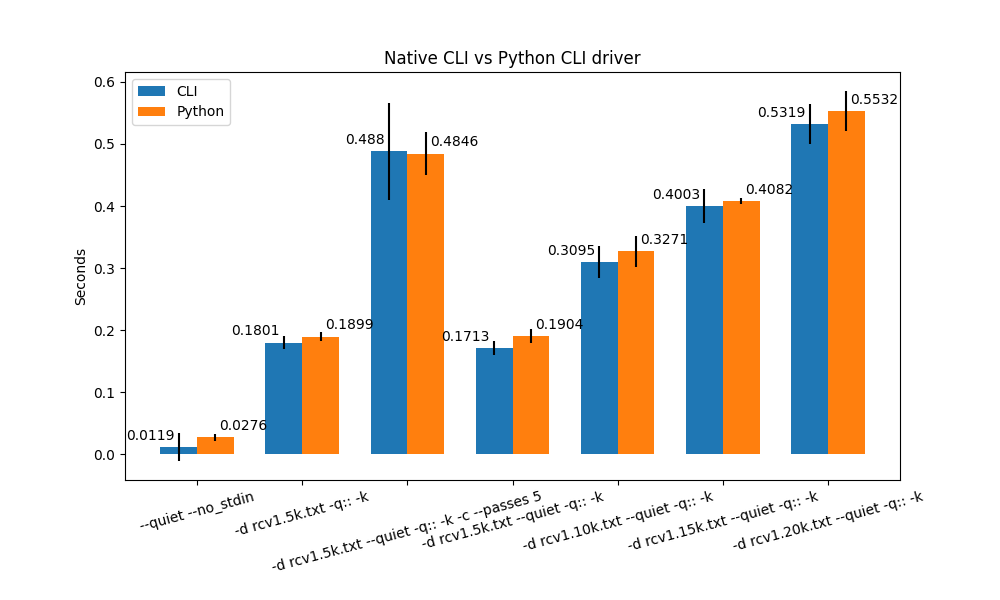

# Benchmarks

Benchmarks done using:
- Python 3.10.8
- Apple M1 Max

## Python Benchmarks

### Results

| Benchmark | PyVW | Python |
| --- | --- | --- |
| init workspace | 1.82 ms ± 0.14 ms | 1.89 ms ± 0.13 ms |
| init + parse dsjson | 2.06 ms ± 0.13 ms | 1.94 ms ± 0.12 ms |
| init + parse + learn dsjson | 2.07 ms ± 0.11 ms | 1.95 ms ± 0.12 ms |

PyVW version `9.6.0` used.

### How to reproduce

Run: `python pyvw_comparison.py`

## Native/Python Benchmarks

### Results

| Benchmark | CLI | Python |
| --- | --- | --- |
| `cache_create.py` | 0.0959 s ± 0.0182 s | 0.1132 s ± 0.0024 s |

`cache_create.py` - Creates a cache file containing the first 10k examples of rcv1.

## CLI/Python Benchmarks

### Results

| Command | CLI | Python |
| --- | --- | --- |
| `--quiet --no_stdin` | 0.0101 s ± 0.0058 s | 0.0306 s ± 0.0064 s |
| `-d rcv1.5k.txt -q:: -k` | 0.1726 s ± 0.0084 s | 0.1959 s ± 0.0119 s |
| `-d rcv1.5k.txt --quiet -q:: -k -c --passes 5` | 0.4562 s ± 0.0507 s | 0.5254 s ± 0.0425 s |
| `-d rcv1.5k.txt --quiet -q:: -k` | 0.1739 s ± 0.0092 s | 0.2042 s ± 0.014 s |
| `-d rcv1.10k.txt --quiet -q:: -k` | 0.2807 s ± 0.0079 s | 0.3097 s ± 0.0173 s |
| `-d rcv1.20k.txt --quiet -q:: -k` | 0.4714 s ± 0.0025 s | 0.5248 s ± 0.0201 s |

The Python startup overhead was also directly measured:

- Completely empty file - `13.1 ms ± 3.8 ms`
- `import vowpal_wabbit_next as vw` and `import sys` - `24.9 ms ± 2.9 ms`

### How to reproduce

#### Dependencies

- `hyperfine`
- Python packages: `matplotlib`, `numpy`

#### Steps

1. Build VW CLI in release mode and update `VW_BIN` in benchmarks.sh
2. Build and install `vowpal_wabbit_next` python package
3. Run `./benchmarks.sh`
4. Run `plot.py`
